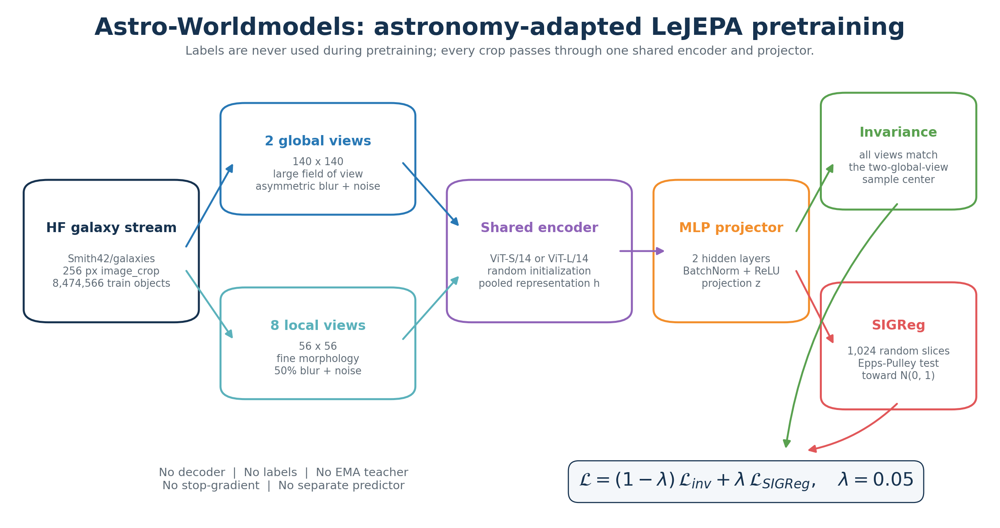
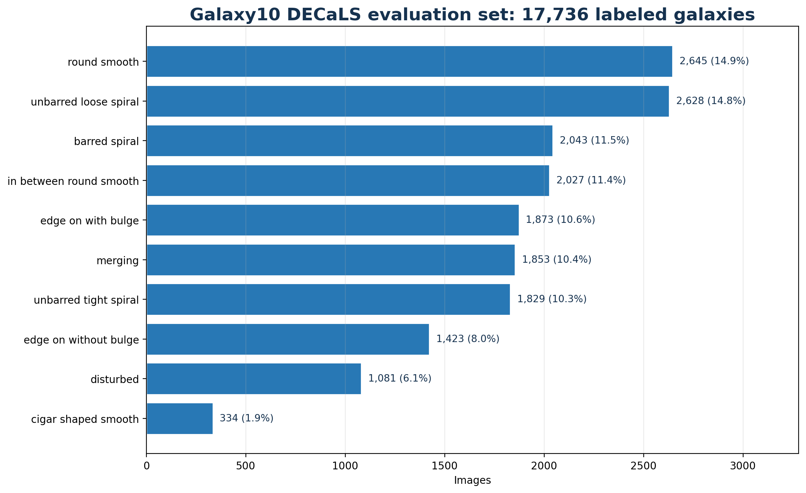
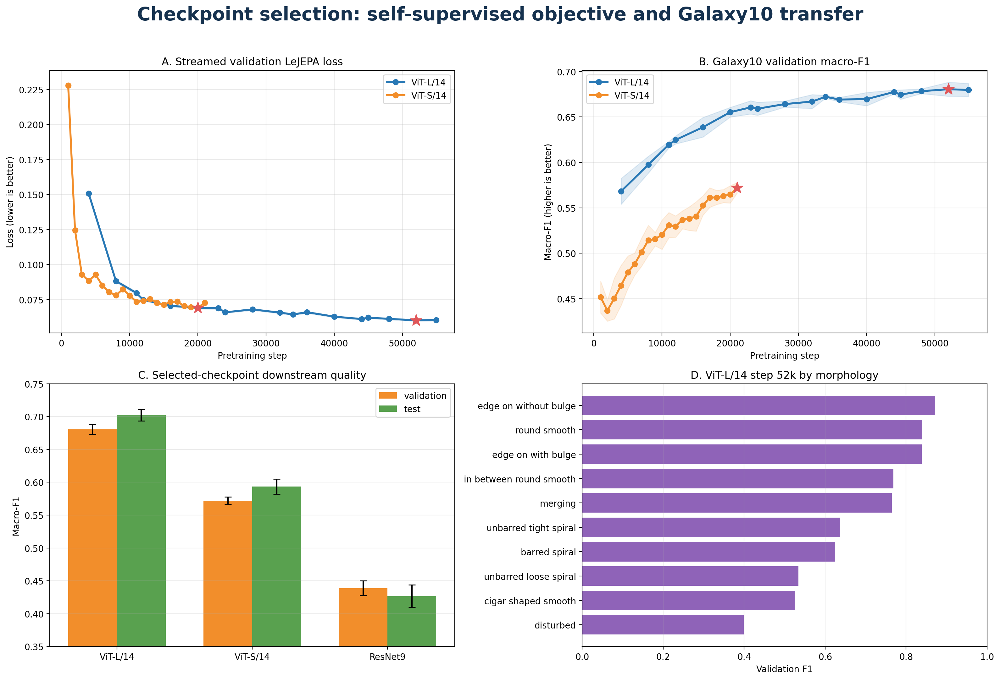
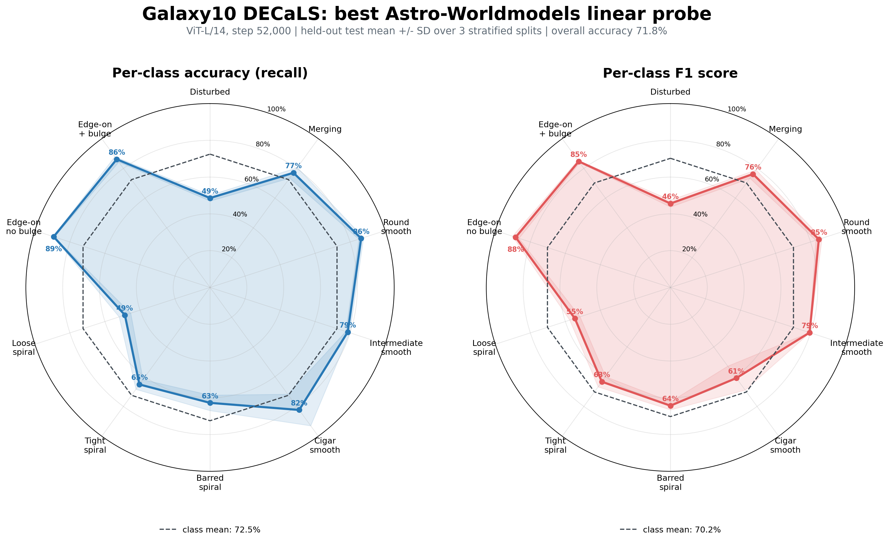

# Astro-Worldmodels

### Self-supervised astronomical representation learning with multi-crop LeJEPA and statistical latent regularization

Astro-Worldmodels trains visual encoders directly from millions of unlabeled
galaxy images. The active method combines astronomy-specific multi-crop
augmentations, a shared Vision Transformer, and the LeJEPA objective: make
different observations of the same galaxy agree while forcing projected
features to retain a non-collapsed, approximately Gaussian population
distribution.

> **Current result, June 9, 2026:** the strongest measured representation is
> **ViT-L/14 at step 52,000**. Its frozen features reach
> **0.6805 +/- 0.0077 validation macro-F1** and
> **0.7023 +/- 0.0090 test macro-F1** on Galaxy10 DECaLS using a controlled
> linear probe. The result is selected using validation data only.



## At A Glance

| Component | Active implementation |
|---|---|
| Scientific domain | Optical galaxy imagery and galaxy morphology |
| Pretraining data | [`Smith42/galaxies`](https://huggingface.co/datasets/Smith42/galaxies), streamed from Hugging Face |
| Labels during pretraining | None |
| Primary backbone | `vit_large_patch14_dinov2.lvd142m`, initialized from scratch |
| Other trained backbones | ViT-S/14 and an early ResNet9 baseline |
| Views per ViT training example | 2 global crops at `140 x 140` and 8 local crops at `56 x 56` |
| Representation objective | Multi-view agreement around a two-global-view center |
| Collapse regularizer | Sliced Epps-Pulley normality statistic, called SIGReg |
| Projection dimension | 64 for ViT-L/14; 128 for ViT-S/14 and ResNet9 |
| Distributed training | PyTorch DDP with NCCL, mixed precision, and HF streaming shards |
| Downstream benchmark | Galaxy10 DECaLS, 10-way morphology classification |
| Recommended checkpoint | `checkpoints/VitLargePatch14_OfficialTrain5_Epoch5_2504/step_52000.pt` |

## Table Of Contents

1. [Abstract](#abstract)
2. [What This Project Is](#what-this-project-is)
3. [Scientific Motivation](#scientific-motivation)
4. [Method](#method)
5. [Training Objective](#training-objective)
6. [Data](#data)
7. [Astronomy-Specific Augmentations](#astronomy-specific-augmentations)
8. [Model Architectures](#model-architectures)
9. [Optimization And Distributed Training](#optimization-and-distributed-training)
10. [Checkpoint Evaluation](#checkpoint-evaluation)
11. [Results](#results)
12. [How To Select A Model](#how-to-select-a-model)
13. [Reproduction](#reproduction)
14. [Repository Map](#repository-map)
15. [Known Limitations](#known-limitations)
16. [References](#references)

## Abstract

Large astronomical surveys contain far more images than can be labeled by
experts or citizen scientists. Astro-Worldmodels investigates whether a visual
encoder can learn transferable galaxy representations from these unlabeled
images alone. Each source galaxy is transformed into multiple physically
plausible observations at different spatial scales. A shared encoder and MLP
projector map every observation into a latent vector. The first part of the
objective enforces invariance by moving all projected views toward the mean of
two global views from the same source object. This agreement objective has a
trivial constant solution, so the second part uses random one-dimensional
projections and an Epps-Pulley characteristic-function statistic to make the
population of projected features resemble a standard multivariate normal.

The principal experiment trains a randomly initialized ViT-L/14 for 54,940
steps over five streamed passes through approximately 8.44 million training
examples per pass. It processes 42.2 million source-image exposures and 421.9
million augmented views. Checkpoints are evaluated in two complementary ways:

1. The LeJEPA objective is replayed on fixed streamed train, validation, and
   test samples.
2. The frozen backbone is tested through a deterministic, class-balanced linear
   probe on all 17,736 Galaxy10 DECaLS images.

The downstream experiment identifies ViT-L/14 step 52,000 as the best
checkpoint. It outperforms the selected ViT-S/14 checkpoint by 10.86 percentage
points in validation macro-F1 and the ResNet9 baseline by 24.18 points. The
late ViT-L checkpoints form a broad plateau, suggesting that representation
quality has nearly saturated rather than sharply overfit.

## What This Project Is

Astro-Worldmodels is a **self-supervised representation-learning project**. Its
learned backbone converts a galaxy image into a compact feature vector that can
support later scientific tasks such as morphology classification, similarity
search, anomaly discovery, clustering, or parameter estimation.

The name "worldmodels" expresses the goal of learning structure from the
unlabeled astronomical image distribution. The current implementation is not a
generative simulator:

- it does not reconstruct pixels;
- it does not predict masked image patches;
- it does not contain a decoder;
- it does not generate new galaxies;
- it does not use a teacher network or exponential moving average;
- it does not consume Galaxy10 labels during pretraining.

It is also not the canonical masked-image I-JEPA architecture. The local
implementation is a direct multi-view joint-embedding model with a statistical
regularizer, following the LeJEPA formulation.

## Scientific Motivation

Galaxy morphology carries information about formation history, mergers,
environment, star formation, and dynamical state. Labels are expensive because
the boundaries between classes are gradual and scientifically ambiguous:
round and intermediate smooth galaxies overlap, spiral winding is continuous,
and disturbed or merging systems can be rare.

Self-supervision is useful here for three reasons:

1. **Survey scale.** The pretraining set contains 8,474,566 training objects,
   while the downstream benchmark contains only 17,736 labels.
2. **Physical symmetries.** A galaxy's identity and morphology should usually
   survive rotations, reflections, modest changes in crop, point-spread
   function, and observational noise.
3. **Transfer.** A representation learned without a specific target can later
   be tested on several scientific questions rather than one fixed label set.

The central hypothesis is therefore:

> A representation that is invariant to survey-realistic observational changes
> while preserving a rich, non-collapsed latent population should expose
> galaxy morphology to simple downstream models.

## Method

For every source image, the data pipeline creates:

- two global crops containing most of the object and its immediate context;
- eight local crops emphasizing smaller morphological structures;
- independent orientation, blur, and noise perturbations.

Every crop passes through the same backbone \(f_\theta\) and projector
\(g_\phi\):

$$
h_i^{(v)} = f_\theta\left(x_i^{(v)}\right), \qquad
z_i^{(v)} = g_\phi\left(h_i^{(v)}\right).
$$

Here:

- \(i\) indexes a source galaxy;
- \(v\) indexes an augmented view;
- \(h\) is the backbone representation retained for downstream use;
- \(z\) is the lower-dimensional projected representation used only by the
  pretraining objective.

For a ViT batch, the implementation receives tensors shaped:

```text
global_crops: [batch, 2, 3, 140, 140]
local_crops:  [batch, 8, 3,  56,  56]
```

The view dimension is flattened into the batch dimension for the shared
backbone and then restored. The final projection tensor is arranged as:

```text
z: [10 views, batch, projection_dim]
```

Because the patch size is 14 pixels, the ViT sees a `10 x 10` patch grid for a
global crop and a `4 x 4` grid for a local crop. TIMM dynamic image sizing is
enabled, allowing both resolutions to pass through the same transformer.

## Training Objective

### 1. Multi-view invariance

Let the first \(V_g=2\) views be global crops. Their per-object center is:

$$
c_i = \frac{1}{V_g}\sum_{g=1}^{V_g} z_i^{(g)}.
$$

All global and local projections are moved toward this center:

$$
\mathcal{L}_{\mathrm{inv}}
=
\frac{1}{BVP}
\sum_{i=1}^{B}
\sum_{v=1}^{V}
\left\|z_i^{(v)}-c_i\right\|_2^2.
$$

The implementation averages over the batch, views, and projection dimensions.
The center is not detached, so gradients flow through both global projections.
There is no stop-gradient branch and no separate predictor.

This term teaches:

- rotational and reflection invariance;
- robustness to local versus global context;
- robustness to plausible PSF and noise differences;
- agreement between fine morphological detail and whole-object appearance.

### 2. Why invariance alone collapses

If every image and every view maps to one constant vector, then all views agree
perfectly and \(\mathcal{L}_{\mathrm{inv}}=0\). The invariance term alone
therefore admits a useless solution.

The projector's BatchNorm layers help numerically, but the explicit defense
against collapse is SIGReg.

### 3. Sliced Gaussian regularization

For each view \(v\), collect its projected batch into
\(Z^{(v)}\in\mathbb{R}^{B\times P}\). The implementation samples
\(K=1024\) Gaussian direction vectors and normalizes every direction:

$$
a_k \sim \mathcal{N}(0,I_P), \qquad
\tilde{a}_k = \frac{a_k}{\|a_k\|_2}.
$$

Each high-dimensional projected representation is reduced to a scalar:

$$
y_{ik}^{(v)} = z_i^{(v)\top}\tilde{a}_k.
$$

If the multivariate projected population is standard normal, then every
one-dimensional slice should also be standard normal. The code tests this with
an Epps-Pulley statistic based on the empirical characteristic function:

$$
\hat{\varphi}_k(t)
=
\frac{1}{N}\sum_{i=1}^{N}\exp\left(it y_{ik}\right),
\qquad
\varphi_0(t)=\exp\left(-\frac{t^2}{2}\right).
$$

For each slice:

$$
T_k
=
N\int
\left|\hat{\varphi}_k(t)-\varphi_0(t)\right|^2
\exp\left(-\frac{t^2}{2}\right)\,dt.
$$

The actual numerical implementation:

- evaluates 17 points over \(t\in[0,3]\);
- uses trapezoidal integration;
- uses symmetry to account for negative \(t\);
- reduces empirical sine and cosine means across distributed ranks;
- averages the statistic over 1,024 random slices;
- draws new synchronized random slices on successive calls;
- computes the statistic independently for every view and averages over views.

This term is denoted:

$$
\mathcal{L}_{\mathrm{SIGReg}}
=
\frac{1}{V}\sum_{v=1}^{V}
\operatorname{SIGReg}\left(Z^{(v)}\right).
$$

### 4. Combined loss

The final objective is:

$$
\boxed{
\mathcal{L}
=
(1-\lambda)\mathcal{L}_{\mathrm{inv}}
+\lambda\mathcal{L}_{\mathrm{SIGReg}}
}
\qquad \lambda=0.05.
$$

The weighting gives 95% of the explicit coefficient mass to within-object view
agreement and 5% to population-level distribution regularization. The raw
magnitudes of the two terms differ, so the contribution should be interpreted
from the measured values rather than the coefficients alone.

### 5. What representation is used downstream?

The MLP projector exists to shape the training objective. Downstream
evaluation discards it and uses the backbone output \(h\). This is important:
Galaxy10 measures whether the backbone itself acquired linearly accessible
morphology, not whether the SIGReg projection space directly classifies the
benchmark.

## Data

### Pretraining: `Smith42/galaxies`

The active loader calls:

```python
load_dataset(
    "Smith42/galaxies",
    columns=["image_crop"],
    split=split,
    streaming=True,
)
```

The Hugging Face builder reports:

| Split | Objects |
|---|---:|
| Train | 8,474,566 |
| Validation | 86,499 |
| Test | 86,471 |
| Total | 8,647,536 |

Available fields are `image`, `image_crop`, `dr8_id`, and `galaxy_size`. The
training code deliberately requests only `image_crop`, a 256-pixel RGB crop.
Object identifiers, size metadata, labels, redshifts, and other catalog
attributes are not used by the model.

The dataset card describes the images as galaxy-centered cutouts derived from
DESI Legacy Imaging Surveys releases, assembled for AstroPT. The dataset is
licensed CC-BY-SA-4.0. The repository does not pin a dataset revision, so exact
future reproduction should record a Hugging Face commit hash.

### Streaming and sharding

The dataset is an `IterableDataset`; it is never materialized locally in full.
For training:

1. A 50,000-example streaming shuffle buffer is created with seed 42.
2. `set_epoch(epoch)` changes the streamed order between epochs.
3. Each DDP rank owns one dataset instance.
4. Every DataLoader worker receives a unique shard.
5. The total shard count is `world_size * num_workers`.
6. The shard index is `rank * num_workers + worker_id`.

This avoids duplicated source examples across GPU processes and loader workers
within a pass.

### Downstream evaluation: Galaxy10 DECaLS

The controlled probe uses the local HDF5 file:

```text
Evals/DeCals_linearProbing/galaxy10/Galaxy10_DECals.h5
```

It contains 17,736 RGB images with shape `256 x 256 x 3` and ten morphology
classes. The class distribution is strongly imbalanced:



| Class | Images | Share |
|---|---:|---:|
| Disturbed | 1,081 | 6.1% |
| Merging | 1,853 | 10.4% |
| Round smooth | 2,645 | 14.9% |
| In-between round smooth | 2,027 | 11.4% |
| Cigar-shaped smooth | 334 | 1.9% |
| Barred spiral | 2,043 | 11.5% |
| Unbarred tight spiral | 1,829 | 10.3% |
| Unbarred loose spiral | 2,628 | 14.8% |
| Edge-on without bulge | 1,423 | 8.0% |
| Edge-on with bulge | 1,873 | 10.6% |

Macro-F1 is therefore the primary checkpoint-selection metric. Plain accuracy
would give the largest classes disproportionate influence.

## Astronomy-Specific Augmentations

The transform is inspired by the galaxy-image pretraining strategy described
by AstroCLIP and by public Legacy Survey augmentation code.

### Geometry

| View | Count | Output | Crop area scale | Aspect ratio | Orientation |
|---|---:|---:|---:|---:|---|
| Global | 2 | `140 x 140` | 0.947 | 1.0 | horizontal flip, vertical flip, rotation from 0 to 180 degrees |
| Local | 8 | `56 x 56` | 0.394 | 1.0 | horizontal flip, vertical flip, rotation from 0 to 180 degrees |

The crop scale is currently fixed rather than sampled from a range. Crop
location and orientation remain stochastic.

### Observation model

The two global views are intentionally asymmetric:

| Perturbation | Global view 1 | Global view 2 | Each local view |
|---|---:|---:|---:|
| Astronomy-tuned Gaussian blur | 100% | 10% | 50% |
| Astronomy-tuned Gaussian noise | 100% | 10% | 50% |

Blur and noise are channel-specific because survey bands have different
point-spread functions and noise characteristics. The augmentation code:

1. samples a plausible existing channel-wise variance;
2. samples a target variance from fitted survey distributions;
3. adds only the non-negative extra variance required to reach that target.

For variance-like quantities this is:

$$
\sigma_{\mathrm{augment}}
=
\sqrt{\max\left(0,\sigma_{\mathrm{target}}^2-\sigma_{\mathrm{true}}^2\right)}.
$$

Images are converted to RGB float tensors in \([0,1]\). There is no ImageNet
mean/std normalization during pretraining. The controlled Galaxy10 evaluation
matches this input scale.

## Model Architectures

### Vision Transformer encoders

Both transformer names come from TIMM's DINOv2-compatible architecture
definitions, but `pretrained=False`: no DINOv2 weights are loaded.

| Run | Backbone parameters | Projector parameters | Total trainable parameters | Backbone output | Projector |
|---|---:|---:|---:|---:|---|
| ViT-S/14 | 22,056,192 | 987,776 | 23,043,968 | 384 | `384 -> 768 -> 768 -> 128` |
| ViT-L/14 | 304,367,616 | 6,434,880 | 310,802,496 | 1,024 | `1024 -> 2048 -> 2048 -> 64` |

Each hidden projector layer is:

```text
Linear -> BatchNorm1d -> ReLU -> Dropout(0)
```

The final layer is linear, followed by zero-probability dropout. Projector
linear layers receive Kaiming-normal initialization; BatchNorm scale is one and
bias is zero. Backbone initialization is delegated to TIMM.

ViT-L contains approximately 13.49 times as many trainable parameters as
ViT-S. Its selected downstream checkpoint gains 10.86 macro-F1 percentage
points over ViT-S, so the project currently favors absolute quality rather than
parameter efficiency.

### ResNet9 baseline

The earlier convolutional baseline contains:

- a 2,440,648-parameter ResNet9-like backbone;
- residual blocks at 128 and 256 channels;
- adaptive max-pooling to `2 x 2`;
- a 1,024-dimensional flattened representation;
- a `1024 -> 2048 -> 2048 -> 128` projector;
- 9,006,664 total trainable parameters.

Its saved run used two global views and no local crops. Its SIGReg
implementation also predates the current library path. Raw self-supervised loss
is therefore not directly comparable to the ViT runs.

## Optimization And Distributed Training

### Shared optimizer configuration

| Setting | Value |
|---|---:|
| Optimizer | AdamW |
| Initial learning rate | `5e-4` |
| Warmup | 1,000 optimizer steps |
| Warmup start factor | 0.01, corresponding to `5e-6` |
| Schedule after warmup | Cosine annealing |
| Minimum learning rate | `1e-6` |
| ViT weight decay | `5e-2` |
| ResNet9 weight decay | `5e-4` |
| Precision | bfloat16 autocast |
| Gradient accumulation | 1 |
| Base random seed | 42 plus DDP rank |

With bfloat16, gradient scaling is disabled. CUDA TF32 is allowed, cuDNN
benchmarking is enabled, and float32 matrix-multiplication precision is set to
`high`.

### Distributed execution

Training initializes an NCCL process group and wraps the model in
`DistributedDataParallel` with:

- one process per GPU;
- `broadcast_buffers=False`;
- `gradient_as_bucket_view=True`;
- `static_graph=True`;
- a 60-minute distributed timeout.

Losses and collapse diagnostics are averaged across ranks for logging.
Monitored statistics include:

- total LeJEPA loss;
- invariance term;
- SIGReg term;
- mean and minimum feature standard deviation;
- mean and minimum projection standard deviation;
- learning rate and global step.

The ViT-L training log finishes with a projection mean standard deviation near
1.0, consistent with the intended standard-normal projection scale.

### Completed runs

The table below is reconstructed from the configurations stored inside the
actual checkpoint files, not only from the current editable config.

| Run | Views | Batch/rank | Recorded steps | Training extent | Checkpoint cadence | Source-image exposures at 4 ranks | Augmented-view exposures |
|---|---:|---:|---:|---:|---:|---:|---:|
| ResNet9 baseline | 2 global | 128 | 8,000 | step 8k in zero-indexed epoch 0 | 8,000 | 4,096,000 | 8,192,000 |
| ViT-S/14 | 2 global + 8 local | 96 | 21,000 | step 21k in zero-indexed epoch 0 | 1,000 | 8,064,000 | 80,640,000 |
| ViT-L/14 | 2 global + 8 local | 192 | 54,940 | 5 completed passes | 4,000 plus epoch ends | 42,193,920 | 421,939,200 |

The exposure counts use the repository's four-rank training convention:

```text
source exposures = steps * batch_per_rank * 4
view exposures   = source exposures * views_per_source
```

For ViT-L, the saved schedule explicitly records 10,988 steps per epoch and
54,940 total steps. The training log records 304.4M backbone parameters, 6.4M
projector parameters, and four active DDP ranks.

### Checkpoint contents

Every training checkpoint stores:

- backbone and projector weights;
- AdamW optimizer state;
- scheduler state;
- AMP scaler state;
- epoch and global step;
- serialized training configuration;
- Python, CPU Torch, and all CUDA RNG states.

This is why ViT-L checkpoint files are approximately 3.7 GB even though the
model itself contains about 311M parameters. Resume restores model,
optimization, schedule, scaler, and RNG state.

## Checkpoint Evaluation

Training loss alone does not establish scientific usefulness. The repository
therefore contains two complementary evaluators.

### A. Streamed LeJEPA objective curves

[`Evals/checkpoint_loss_curves`](Evals/checkpoint_loss_curves) reconstructs the
saved model and objective for each checkpoint, then evaluates fixed streamed
samples from all three Hugging Face splits.

Default protocol:

| Split | GPUs | DataLoader workers | Batches | Sampling |
|---|---:|---:|---:|---|
| Train | 4 | checkpoint config | 64 per rank | fixed stream; shuffle buffer disabled |
| Validation | 1 | exactly 1 | 64 | fixed seed and dataset epoch |
| Test | 1 | exactly 1 | 64 | fixed seed and dataset epoch |

The evaluator reports total loss, invariance, SIGReg, standard errors across
batches, and validation-minus-train loss. It reuses the same seed and stream
epoch for every checkpoint.

#### These are stochastic mean losses, not full-dataset totals

The plotted value is the mean objective over a controlled subset of batches.
For example:

- ViT-L validation evaluates `64 * 192 = 12,288` images;
- ViT-L train evaluates `64 * 192 * 4 = 49,152` images;
- ViT-S validation evaluates 6,144 images;
- ViT-S train evaluates 24,576 images.

The objective is also batch-dependent. SIGReg estimates an empirical
distribution from the current global batch and multiplies its statistic by
sample count. Changing per-rank batch size or DDP world size changes the
statistical estimator, even when the underlying model is unchanged.

Consequences:

- compare checkpoints only under the same evaluation protocol;
- do not interpret the train-validation gap exactly like supervised
  cross-entropy;
- do not rank ResNet9 against the ViTs by raw LeJEPA loss;
- use these curves primarily to detect within-run convergence, instability, or
  late objective degradation.

### B. Controlled Galaxy10 linear probes

[`Evals/galaxy10_checkpoint_evolution`](Evals/galaxy10_checkpoint_evolution)
provides the clean downstream experiment used for model selection.

Protocol:

1. Load each healthy checkpoint and discard its projector.
2. Resize every Galaxy10 image deterministically to `140 x 140`.
3. Convert RGB to float in \([0,1]\), with no ImageNet normalization.
4. Extract frozen backbone embeddings for all 17,736 images.
5. Create stratified 80/10/10 train/validation/test splits.
6. Repeat the split with seeds 42, 43, and 44.
7. Standardize features using training statistics only.
8. Train a full-batch multinomial linear classifier from zero initialization.
9. Optimize with deterministic LBFGS and class-balanced cross-entropy.
10. Select L2 regularization from `1e-6`, `1e-4`, `1e-3`, and `1e-2` using
    validation macro-F1 only.
11. Select the checkpoint by mean validation macro-F1, breaking ties with
    validation accuracy.
12. Report test performance only after selection.

The full sweep evaluated 40 healthy unique checkpoints:

- 18 ViT-L/14 checkpoints;
- 21 ViT-S/14 checkpoints;
- one ResNet9 checkpoint.

The corrupt `FirstTrain_VitSmallPatch14_2104` family is intentionally excluded.
All 40 checkpoint evaluations completed without errors.

## Results



### Self-supervised objective

| Model | Objective-selected step | Train loss | Validation loss | Validation standard error | Test loss |
|---|---:|---:|---:|---:|---:|
| ViT-L/14 | 52,000 | 0.07084 | **0.06013** | 0.00058 | 0.06063 |
| ViT-S/14 | 20,000 | 0.08970 | **0.06908** | 0.00051 | 0.06916 |
| ResNet9 | 8,000 | 0.02702 | 0.04956 | 0.00339 | 0.04966 |

Within the comparable ViT protocols:

- ViT-L validation loss falls from 0.15072 at step 4,000 to 0.06013 at step
  52,000, a 60.1% reduction.
- ViT-S validation loss falls from 0.22791 at step 1,000 to 0.06908 at step
  20,000, a 69.7% reduction.
- ViT-S rises slightly to 0.07273 at step 21,000.
- ViT-L changes only from 0.06013 at step 52,000 to 0.06037 at step 54,940,
  indicating a late plateau rather than meaningful degradation.

The ResNet9 value is not an architecture leaderboard result because that run
uses fewer views, a different projector history, and a legacy SIGReg path.

### Galaxy10 checkpoint selection

| Model | Selected step | Validation accuracy | Validation macro-F1 | Test accuracy | Test macro-F1 |
|---|---:|---:|---:|---:|---:|
| **ViT-L/14** | **52,000** | 0.7023 +/- 0.0094 | **0.6805 +/- 0.0077** | 0.7183 +/- 0.0084 | **0.7023 +/- 0.0090** |
| ViT-S/14 | 21,000 | 0.5913 +/- 0.0026 | 0.5719 +/- 0.0058 | 0.6119 +/- 0.0142 | 0.5934 +/- 0.0116 |
| ResNet9 | 8,000 | 0.4581 +/- 0.0109 | 0.4387 +/- 0.0112 | 0.4480 +/- 0.0175 | 0.4269 +/- 0.0170 |

The held-out test split is not used to pick checkpoints. Its slightly higher
score for the selected ViTs reflects split variability, not test-set tuning.

### Evolution of transferable quality

| Model | Earliest measured validation macro-F1 | Best validation macro-F1 | Absolute gain |
|---|---:|---:|---:|
| ViT-L/14, step 4k to 52k | 0.5682 | 0.6805 | +0.1124 |
| ViT-S/14, step 1k to 21k | 0.4519 | 0.5719 | +0.1200 |

The curves show:

1. Both ViTs learn increasingly linearly separable morphology.
2. ViT-L is already stronger at its first evaluated checkpoint than ViT-S is
   at its final checkpoint.
3. ViT-L improves quickly through approximately 20k steps and then enters a
   slower, noisy plateau.
4. ViT-S is still improving at its last checkpoint by the downstream metric,
   despite a small self-supervised loss rebound.
5. Self-supervised loss and downstream quality are correlated but not
   identical model selectors.

### Per-class behavior of the selected ViT-L/14

Mean validation F1 at step 52,000:

| Morphology | F1 |
|---|---:|
| Edge-on without bulge | 0.87 |
| Round smooth | 0.84 |
| Edge-on with bulge | 0.84 |
| In-between round smooth | 0.77 |
| Merging | 0.77 |
| Unbarred tight spiral | 0.64 |
| Barred spiral | 0.63 |
| Unbarred loose spiral | 0.53 |
| Cigar-shaped smooth | 0.52 |
| Disturbed | 0.40 |

The weakest class, disturbed, is visually heterogeneous. Cigar-shaped smooth
is also difficult and has only 334 examples. The strongest classes have both
clear global geometry and substantially more labeled support.

Held-out test behavior, averaged across the three stratified splits:



Here, per-class accuracy means recall: the fraction of examples from a true
class assigned to that class. The dashed rings are the unweighted class means:
72.5% balanced accuracy and 70.2% macro-F1. The ordinary example-weighted test
accuracy is 71.8%.

### Model size versus Galaxy10 accuracy

| Model | Trainable parameters | Selected checkpoint | Validation accuracy | Test accuracy |
|---|---:|---:|---:|---:|
| ViT-L/14 | 310.80M | 52,000 | 70.23% +/- 0.94 | **71.83% +/- 0.84** |
| ViT-S/14 | 23.04M | 21,000 | 59.13% +/- 0.26 | **61.19% +/- 1.42** |
| ResNet9 baseline | 9.01M | 8,000 | 45.81% +/- 1.09 | **44.80% +/- 1.75** |

The directly comparable ViT scaling result is a 13.49x parameter increase from
ViT-S/14 to ViT-L/14 for a 10.64 percentage-point increase in mean test
accuracy. ResNet9 is smaller still, but differs in view count and training
history, so it is best treated as an early baseline rather than a clean scaling
point.

## How To Select A Model

### Recommended default

Use:

```text
checkpoints/VitLargePatch14_OfficialTrain5_Epoch5_2504/step_52000.pt
```

Use only keys prefixed by `backbone.` for downstream feature extraction. The
projector is a pretraining head.

### Why step 52,000?

It is simultaneously:

- the minimum measured ViT-L validation LeJEPA loss;
- the maximum measured ViT-L validation Galaxy10 macro-F1;
- statistically tied with nearby late checkpoints within split variation;
- slightly better than the final `complete.pt` checkpoint by both validation
  selectors.

The exact 52k point should not be treated as a sharp physical optimum. Steps
44k through 54,940 form a broad plateau. Step 52k is the best measured member
of that plateau under the present protocol.

### Recommended smaller model

Use:

```text
checkpoints/VitSmallPatch14_2204/step_21000.pt
```

Step 20k minimizes the streamed self-supervised validation loss, but step 21k
has the best downstream validation macro-F1. For scientific transfer, the
downstream-selected step is preferred.

### Selection rules for future runs

1. Reject unreadable or corrupted checkpoints.
2. Verify that objective components remain finite and feature variance does
   not collapse.
3. Compare self-supervised losses only with fixed batch size, world size,
   views, seeds, and sampling.
4. Select hyperparameters and checkpoints using validation data.
5. Prefer macro-F1 or another class-balanced metric for imbalanced morphology.
6. Treat the test set as a final report, not a tuning signal.
7. When several checkpoints are within one standard deviation, prefer the
   earlier or cheaper checkpoint unless later transfer gains are repeatable.
8. Add more than one downstream task before claiming a generally superior
   astronomical foundation model.

## Reproduction

### Environment

The completed experiments use the existing environment:

```text
/mnt/ssd-cluster/pranav/conda/envs/lejepa-og
```

The minimal declared dependencies are in [`requirements.txt`](requirements.txt).
The current runtime also relies on packages used by code or evaluation but not
fully declared there, including `python-dotenv`, `scikit-image`, `h5py`, and
`matplotlib`.

For a fresh environment:

```bash
python -m venv .venv
source .venv/bin/activate
pip install -r requirements.txt
pip install python-dotenv scikit-image h5py matplotlib
```

CUDA-capable PyTorch and NCCL are required for the distributed training path.

### Training

The active entry point is [`train.py`](train.py). It currently instantiates
[`configs/config.py`](configs/config.py) directly.

Before starting a new run:

1. choose the TIMM model and projector dimension;
2. choose `Vg`, `Vl`, batch size, epochs, and checkpoint cadence;
3. set a new `save_dir`;
4. set `resume_path=None` for a fresh run;
5. clear or replace the saved W&B run ID and resume policy;
6. record a Hugging Face dataset revision for strict reproducibility.

Four-GPU launch:

```bash
torchrun --standalone --nproc_per_node=4 train.py
```

The active config is presently the completed ViT-L run and contains a resume
path. Running it unchanged is not a fresh-training command.

### Regenerate streamed objective curves

```bash
bash Evals/checkpoint_loss_curves/run_all.sh
```

Useful overrides:

```bash
TRAIN_GPUS=4 \
TRAIN_BATCHES=128 \
VALIDATION_BATCHES=128 \
TEST_BATCHES=128 \
bash Evals/checkpoint_loss_curves/run_all.sh
```

See
[`Evals/checkpoint_loss_curves/README.md`](Evals/checkpoint_loss_curves/README.md)
for targeted and resumable commands.

### Regenerate Galaxy10 checkpoint evolution

```bash
GPU_LIST=0,1,2,3,4,5,6,7 \
bash Evals/galaxy10_checkpoint_evolution/run_all.sh
```

Outputs include:

- per-checkpoint repeated-split JSON;
- `summary.csv` and `summary.json`;
- `best_checkpoints.json`;
- train, validation, and test evolution plots;
- model-comparison plots;
- per-class F1 visualizations.

See
[`Evals/galaxy10_checkpoint_evolution/README.md`](Evals/galaxy10_checkpoint_evolution/README.md)
for the full probe protocol.

### Regenerate this README's figures

```bash
/mnt/ssd-cluster/pranav/conda/envs/lejepa-og/bin/python \
  docs/generate_readme_figures.py
```

The script reads existing experiment outputs and writes PNG and PDF assets to
`docs/assets`.

### Data and checkpoint availability

The repository's `.gitignore` excludes:

```text
checkpoints/
*.pt
*.h5
```

A normal Git clone therefore does not include the 73 GB local checkpoint tree
or the 2.6 GB Galaxy10 HDF5 file. Reproducing the exact reported numbers
requires access to those external artifacts or a published artifact release.

## Repository Map

| Path | Role | Status |
|---|---|---|
| [`train.py`](train.py) | DDP training entry point, model wrapper, LeJEPA loss, optimization, checkpointing | Active |
| [`configs/config.py`](configs/config.py) | Current ViT-L run configuration | Active but points at a completed resume |
| [`data/galaxies_source.py`](data/galaxies_source.py) | Hugging Face streaming source | Active |
| [`data/dataloaders.py`](data/dataloaders.py) | IterableDataset, DDP/worker sharding, multi-crop dispatch | Active |
| [`data/AstroTransforms.py`](data/AstroTransforms.py) | Geometry, survey-tuned blur, survey-tuned noise | Active |
| [`models/resnet9.py`](models/resnet9.py) | MLP projector and historical ResNet9 backbone | MLP active; ResNet9 baseline |
| [`lejepa/`](lejepa) | Univariate tests, multivariate slicing, Epps-Pulley SIGReg | Active |
| [`Evals/checkpoint_loss_curves/`](Evals/checkpoint_loss_curves) | Streamed train/validation/test objective evolution | Active evaluation |
| [`Evals/galaxy10_checkpoint_evolution/`](Evals/galaxy10_checkpoint_evolution) | Controlled repeated Galaxy10 linear probes | Primary downstream evaluation |
| [`Evals/DeCals_linearProbing/`](Evals/DeCals_linearProbing) | Earlier Galaxy10 probing code and historical outputs | Superseded |
| [`checkpoints/`](checkpoints) | Local model states and generated objective plots | Artifacts; ignored by Git |
| [`logs/`](logs) | Training logs, including completed ViT-L run | Historical record |
| [`depreciated/`](depreciated) | Profiling, rough tests, attention/PCA exploration, earlier trainers | Historical only |
| [`docs/`](docs) | Reproducible repository-level figures | Documentation |

### Which evaluation should be trusted?

Use the controlled experiment in
[`Evals/galaxy10_checkpoint_evolution`](Evals/galaxy10_checkpoint_evolution).
The older
[`Evals/DeCals_linearProbing`](Evals/DeCals_linearProbing)
experiments used inconsistent preprocessing, including 518-pixel TIMM defaults
and ImageNet-style assumptions that did not match pretraining. They remain in
the repository as historical work but should not be used for current model
selection.

## Known Limitations

### Scientific scope

- Galaxy10 is only one downstream task.
- Linear separability does not prove usefulness for regression, retrieval,
  segmentation, anomaly detection, or physical parameter inference.
- The pretraining and downstream images are both galaxy-centered optical
  imagery, so transfer to other instruments or modalities is untested.
- No comparison is yet reported against supervised ImageNet, DINOv2,
  AstroCLIP, or other astronomy foundation-model baselines under an identical
  probe protocol.

### Data and reproducibility

- The Hugging Face dataset revision is not pinned.
- The local HDF5 benchmark and model checkpoints are ignored by Git.
- The project seed helper does not explicitly seed NumPy, while blur and noise
  use NumPy RNG. Current runs rely on PyTorch DataLoader worker seeding for
  those transforms rather than recording a project-level NumPy seed policy.
- Exact worker scheduling, library versions, and streaming order may therefore
  vary between systems.
- The current dependency file does not fully enumerate the working
  environment.

### Training implementation

- Configuration is imported directly rather than selected through a CLI.
- The current config contains a run-specific resume path and W&B resume ID.
- `train_num_images` and `grad_accum_steps` are stored but are not used to
  control the active loop.
- Validation is not performed inside `train.py`; it is a post-training
  checkpoint sweep.
- The global-view center is not detached. This is intentional in the current
  code but differs from teacher/student self-distillation designs.
- There is no gradient clipping or explicit NaN recovery.
- Large checkpoints include optimizer state, producing substantial storage and
  I/O overhead.

### Evaluation interpretation

- Streamed objective plots use 64-batch stochastic subsets by default.
- Train and validation loss use different world sizes and effective global
  batches.
- SIGReg is sample-count and batch-distribution dependent.
- Raw objective values should not be compared across architectures with
  different view counts or legacy regularizers.
- Three Galaxy10 splits quantify some split variability, but more seeds,
  cross-validation, and confidence intervals would strengthen conclusions.
- Test scores should be considered a single final benchmark, not repeated
  tuning feedback.

### Repository maturity

- The repository has no explicit code license file.
- Some directories use the historical spelling `depreciated`; they are
  deprecated, not part of the active pipeline.
- Historical logs include failed starts and resume attempts before the
  completed run.
- The name "worldmodels" is aspirational; the present system is an encoder, not
  a causal or generative world simulator.

## References

1. **LeJEPA: Provable and Scalable Self-Supervised Learning Without the
   Heuristics.** Garrido et al., 2025.
   [arXiv:2511.08544](https://arxiv.org/abs/2511.08544) |
   [implementation](https://github.com/galilai-group/lejepa)
2. **AstroPT: Scaling Large Observation Models for Astronomy.** Pan et al.,
   2024. [arXiv:2405.14930](https://arxiv.org/abs/2405.14930)
3. **AstroCLIP: A Cross-Modal Foundation Model for Galaxies.** Parker et al.,
   2023. [arXiv:2310.03024](https://arxiv.org/abs/2310.03024)
4. **DINOv2: Learning Robust Visual Features without Supervision.** Oquab et
   al., 2023. [arXiv:2304.07193](https://arxiv.org/abs/2304.07193)
5. **Galaxy Zoo DESI: Detailed Morphology Measurements for 8.7M Galaxies in the
   DESI Legacy Imaging Surveys.** Walmsley et al., 2023.
   [DOI:10.1093/mnras/stad2919](https://doi.org/10.1093/mnras/stad2919)
6. **The DESI Legacy Imaging Surveys Data Release 9.** Dey et al., 2022.
   [DOI:10.3847/1538-3881/ac45eb](https://doi.org/10.3847/1538-3881/ac45eb)
7. **Galaxy10 DECaLS dataset.** Leung and Bovy.
   [Zenodo:10845026](https://zenodo.org/records/10845026)

## Citation

No archival paper or software release citation is currently defined for this
repository. Until one exists, cite the repository and the upstream datasets
and methods above. A future release should add `CITATION.cff`, an explicit
license, dataset/checkpoint artifact hashes, and the exact source commit used
for every reported run.
